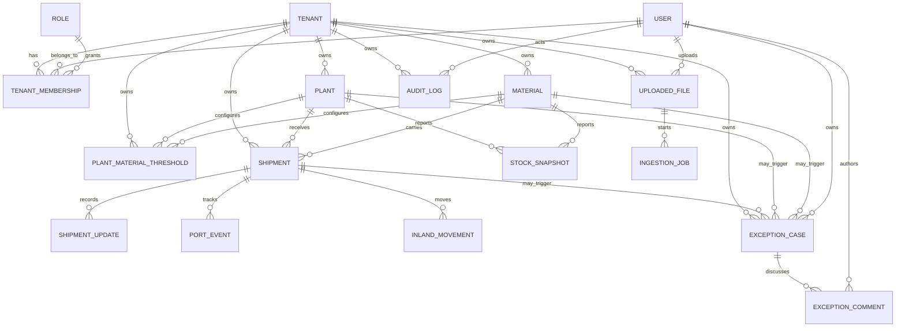

# MVP V1 ERD

This ERD describes the tenant-aware operational database for the raw-material inbound control tower.

## Mermaid ERD

## Tenant Isolation

Every business table includes `tenant_id` and indexes that start with `tenant_id` where tenant-scoped reads are expected. Global identity tables are `users` and `roles`; tenant access is granted through `tenant_memberships`.

Tenant-scoped tables:

- `plants`
- `materials`
- `plant_material_thresholds`
- `shipments`
- `shipment_updates`
- `stock_snapshots`
- `port_events`
- `inland_movements`
- `exception_cases`
- `exception_comments`
- `audit_logs`
- `uploaded_files`
- `ingestion_jobs`

## Key Constraints

- `tenants.slug` is unique.
- `users.email` is unique globally.
- `roles.name` is unique globally.
- `tenant_memberships` is unique by `(tenant_id, user_id)`.
- `plants` is unique by `(tenant_id, code)`.
- `materials` is unique by `(tenant_id, code)`.
- `plant_material_thresholds` is unique by `(tenant_id, plant_id, material_id)`.
- `shipments` is unique by `(tenant_id, shipment_id)`, where `shipment_id` is the business key.

## Enumerations

- `shipment_state`: `planned`, `in_transit`, `at_port`, `discharging`, `inland_transit`, `delivered`, `delayed`, `cancelled`
- `exception_type`: `eta_risk`, `stockout_risk`, `demurrage_risk`, `quality_hold`, `documentation_gap`, `data_quality`
- `exception_severity`: `low`, `medium`, `high`, `critical`
- `exception_status`: `open`, `acknowledged`, `in_progress`, `resolved`, `dismissed`

## Ingestion Flow

`uploaded_files` stores file metadata and upload ownership. `ingestion_jobs` tracks parsing/normalization work for uploaded files or future sources such as AIS, email, EDI, and ERP drops. Normalized ingestion output should create or update `shipments`, `shipment_updates`, `stock_snapshots`, and exception records.

