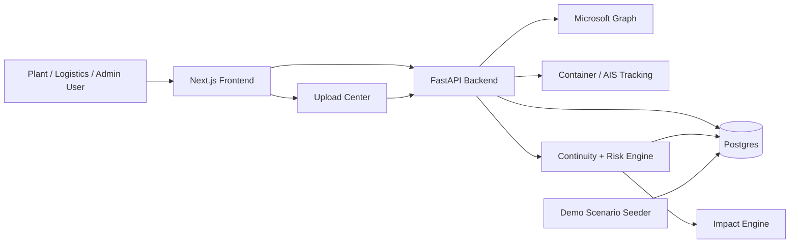
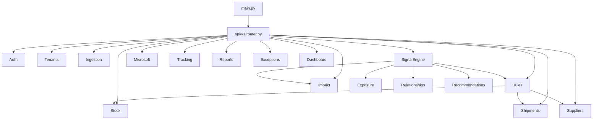
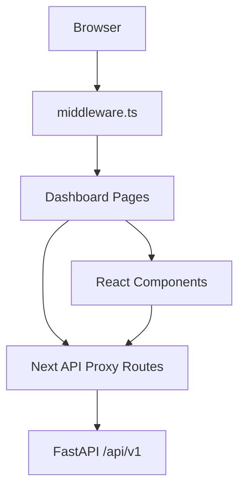
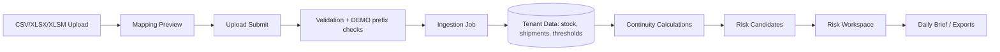
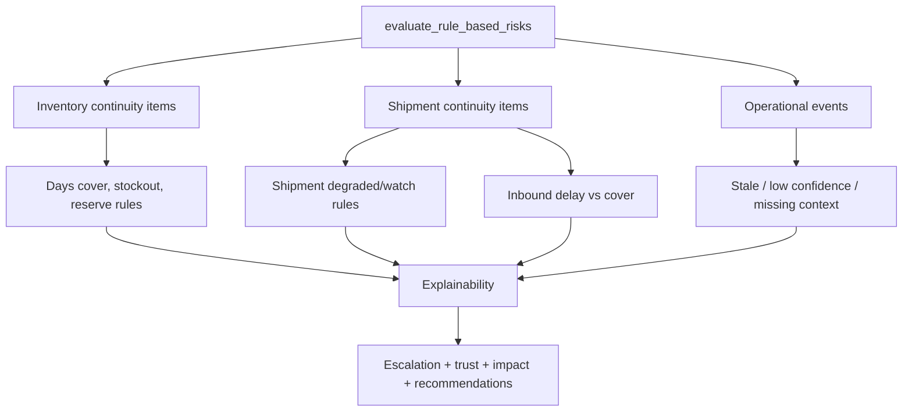
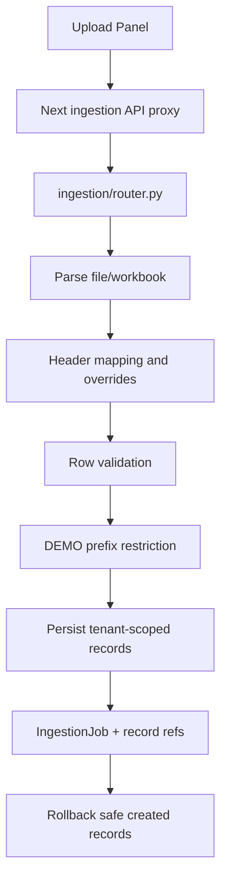
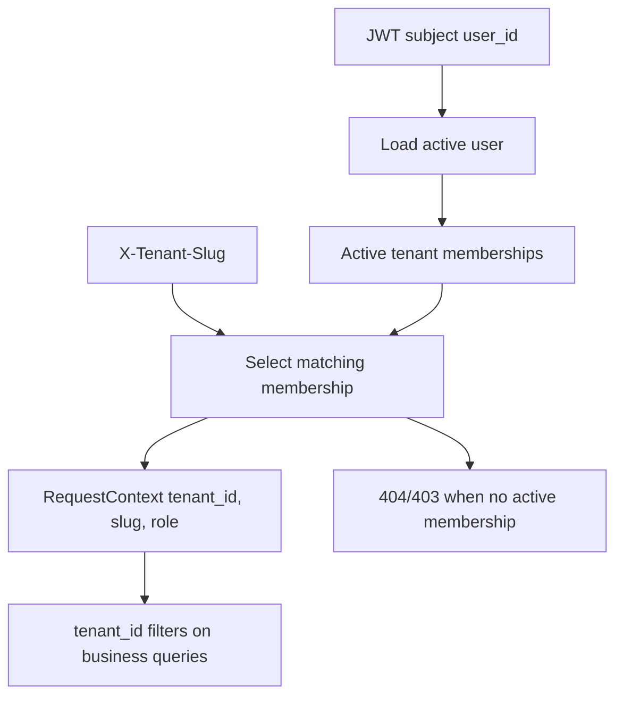

# OpsDeck Final Due Diligence Audit

Date: 2026-06-04  
Scope: product, engineering, architecture, logic, security, calibration, testing  
Method: code and test execution only. Documentation was not treated as proof.

## A. Executive Summary

OpsDeck today is a real continuity intelligence MVP, not a pure mock. It has authenticated multi-tenant backend APIs, upload ingestion, stock/shipment continuity calculations, risk generation, explainability, impact configuration, supplier reliability context, Microsoft file integration, container tracking, and demo tenant scenario support.

It is not pilot-safe yet.

The system is demo-capable if the environment is controlled and the Demo Steel Plant seed is used. It is not safe to present as a complete pilot platform for messy real customer onboarding without fixing session consistency, calibration assumptions, historical validation, supplier onboarding, and demo-side-effect behavior.

Biggest risks:

1. Local frontend API proxy auth is inconsistent. Many routes only read `__Host-opsdeck-session`, while local login writes `opsdeck-session`.
2. Inbound cover can be overtrusted because all non-delivered/non-cancelled shipments can contribute to physical/trusted inbound without a clear ETA horizon filter.
3. Supplier reliability exists, but often collapses to `unknown` when supplier master linking is incomplete.
4. Demo scenario loading mutates database state from the risk workspace read flow.
5. Historical validation, replay, and backtesting are not real product capabilities yet.
6. Broad upload-data deletion is available to operators, not just tenant admins.
7. Risk and impact engines rely on deterministic defaults and fallbacks that may look precise while being uncalibrated.

Verdict:

- Demo readiness: conditional yes, after P0 fixes.
- Pilot readiness: no.
- Production readiness: no.

## B. Product Understanding

### What OpsDeck Actually Does Today

OpsDeck ingests operational files, maps them into tenant-scoped stock, shipment, threshold, and continuity data, then evaluates rule-based continuity risks. It explains risks with inventory context, shipment context, visibility confidence, supplier reliability context, operational trust, interruption impact, timeline, relationship graph, and suggested human actions.

It is closer to a continuity intelligence layer than ERP/procurement software. Recommendation code explicitly forbids procurement automation language in `apps/backend/app/modules/recommendations/operational_actions.py:11`.

### Product Architecture Map



### Backend Architecture Map

Backend entrypoint is `apps/backend/app/main.py`. Routers are included in `apps/backend/app/api/v1/router.py:21`.

Core backend modules:

- Auth: `apps/backend/app/modules/auth`
- Tenant/RBAC context: `apps/backend/app/api/dependencies.py`
- Ingestion: `apps/backend/app/modules/ingestion`
- Stock continuity: `apps/backend/app/modules/stock`
- Shipment continuity and visibility: `apps/backend/app/modules/shipments`
- Supplier reliability: `apps/backend/app/modules/suppliers`
- Rule/risk engine: `apps/backend/app/modules/rules`, `apps/backend/app/modules/signal_engine`
- Impact engine: `apps/backend/app/modules/impact`
- Relationships/exposure/timeline: `apps/backend/app/modules/relationships`, `exposure`, `operational_events`
- Microsoft integration: `apps/backend/app/modules/microsoft`
- Tracking: `apps/backend/app/modules/tracking`
- Reports/exceptions/dashboard/users: respective modules under `apps/backend/app/modules`



### Frontend Architecture Map

Frontend is a Next.js app under `apps/frontend/app`. It contains dashboard pages, API proxy routes, middleware auth refresh, and operational components.

Important pages:

- Login: `apps/frontend/app/login/page.tsx`
- Dashboard: `apps/frontend/app/dashboard/page.tsx`
- Onboarding/upload: `apps/frontend/app/dashboard/onboarding/page.tsx`
- Risk workspace: `apps/frontend/app/dashboard/risk-workspace/page.tsx`
- Operational configuration: `apps/frontend/app/dashboard/admin/operational-configuration/page.tsx`
- Shipments: `apps/frontend/app/dashboard/shipments/page.tsx`
- Suppliers: `apps/frontend/app/dashboard/suppliers/page.tsx`
- Microsoft onboarding: `apps/frontend/app/dashboard/onboarding/microsoft/page.tsx`
- Port/inland tracking: `apps/frontend/app/dashboard/port-inland/page.tsx`



### Data Flow Diagram



### Risk Engine Flow Diagram



### Upload / Ingestion Flow Diagram



### Authentication Flow Diagram

```mermaid
flowchart LR
  Login[POST /api/auth/login] --> BackendLogin[/api/v1/auth/login]
  BackendLogin --> JWT[Access + refresh JWT]
  JWT --> Cookies[httpOnly cookies]
  Cookies --> Middleware[middleware.ts refresh]
  Middleware --> Proxy[Next API routes]
  Proxy --> Bearer[Authorization Bearer]
  Bearer --> BackendContext[get_current_user + get_request_context]
```

### Tenant Isolation Flow Diagram



## C. Capability Matrix

| Capability | Exists in code | Wired end-to-end | Tested | Production-safe | Status |
|---|---:|---:|---:|---:|---|
| Login | Yes | Yes | Yes | Partial | PARTIALLY WORKING |
| Logout | Yes | Yes | Not enough | Partial | PARTIALLY WORKING |
| Session refresh | Yes | Middleware | Backend yes, frontend weak | Partial | PARTIALLY WORKING |
| Session persistence | Yes | Partial | Weak | No | PARTIALLY WORKING |
| Role enforcement | Yes | Yes | Yes | Mostly | FULLY WORKING |
| Tenant membership enforcement | Yes | Yes | Yes | Mostly | FULLY WORKING |
| Tenant isolation | Yes | Yes | Yes | Mostly | FULLY WORKING |
| Tenant switching | Yes | Partial | Some | Partial | PARTIALLY WORKING |
| Cross-tenant protection | Yes | Yes | Yes | Mostly | FULLY WORKING |
| Tenant scoped uploads | Yes | Yes | Yes | Mostly | FULLY WORKING |
| Tenant scoped risk calculations | Yes | Yes | Yes | Mostly | FULLY WORKING |
| File upload | Yes | Yes | Yes | Partial | PARTIALLY WORKING |
| Workbook upload | Yes | Yes | Yes | Partial | PARTIALLY WORKING |
| Multi-sheet upload | Yes | Yes | Yes | Partial | PARTIALLY WORKING |
| Mapping | Yes | Yes | Yes | Partial | PARTIALLY WORKING |
| Mapping override | Yes | Yes | Yes | Partial | PARTIALLY WORKING |
| Preview | Yes | Yes | Yes | Partial | PARTIALLY WORKING |
| Validation | Yes | Yes | Yes | Partial | PARTIALLY WORKING |
| Data quality checks | Yes | Partial | Some | No | PARTIALLY WORKING |
| Import jobs | Yes | Yes | Yes | Mostly | FULLY WORKING |
| Rollback | Yes | Yes | Yes | Partial | PARTIALLY WORKING |
| Materials | Yes | Yes | Yes | Mostly | FULLY WORKING |
| Plants | Yes | Yes | Yes | Mostly | FULLY WORKING |
| Suppliers | Yes | Yes | Yes | Partial | PARTIALLY WORKING |
| Supplier linking | Yes | Partial | Yes | Partial | PARTIALLY WORKING |
| Inventory continuity | Yes | Yes | Yes | Calibration risk | PARTIALLY WORKING |
| Shipment continuity | Yes | Yes | Yes | Calibration risk | PARTIALLY WORKING |
| Cover calculation | Yes | Yes | Yes | Calibration risk | PARTIALLY WORKING |
| Trusted cover | Yes | Yes | Yes | Calibration risk | PARTIALLY WORKING |
| Visibility confidence | Yes | Yes | Yes | Heuristic | PARTIALLY WORKING |
| ETA behaviour | Yes | Yes | Yes | Heuristic | PARTIALLY WORKING |
| Supplier reliability | Yes | Partial | Yes | Not robust | PARTIALLY WORKING |
| Delay vs cover intelligence | Yes | Yes | Yes | Uncalibrated | PARTIALLY WORKING |
| Production interruption impact | Yes | Yes | Yes | Config-dependent | PARTIALLY WORKING |
| Dependency impact | Yes | Partial | Yes | Config-dependent | PARTIALLY WORKING |
| Product/process impact | Yes | Partial | Yes | Config-dependent | PARTIALLY WORKING |
| Substitution impact | Yes | Partial | Yes | Config-dependent | PARTIALLY WORKING |
| Cascading impact | Yes | Yes | Yes | Config-dependent | PARTIALLY WORKING |
| Risk generation | Yes | Yes | Yes | Calibration risk | PARTIALLY WORKING |
| Explainability | Yes | Yes | Yes | Can explain wrong assumptions | PARTIALLY WORKING |
| Action recommendations | Yes | Yes | Yes | Heuristic | PARTIALLY WORKING |
| Timeline | Yes | Yes | Yes | Partial | PARTIALLY WORKING |
| Relationship graph | Yes | Yes | Yes | Partial | PARTIALLY WORKING |
| OneDrive | Yes | Partial | Yes | Needs real tenant validation | PARTIALLY WORKING |
| SharePoint | Yes | Partial | Yes | Needs real tenant validation | PARTIALLY WORKING |
| Container tracking | Yes | Partial | Yes | Mock/provider dependent | PARTIALLY WORKING |
| AIS tracking | Code path/profile | Partial | Some | Not proven live | PARTIALLY WORKING |
| Continuity thresholds | Yes | Yes | Yes | Mostly | FULLY WORKING |
| Production impact config | Yes | Yes | Yes | Mostly | FULLY WORKING |
| Material criticality config | Partial | Partial | Some | No | PARTIALLY WORKING |
| Supplier configuration | Yes | Partial | Yes | Partial | PARTIALLY WORKING |
| Demo tenant | Yes | Yes | Yes | Mostly | FULLY WORKING |
| Scenario seeding | Yes | Yes | Yes | Demo-only side effects | DEMO ONLY |
| Scenario isolation | Yes | Mostly | Yes | Side-effect risk | PARTIALLY WORKING |
| Historical validation | Minimal inputs only | No | No | No | MISSING |
| Replay capability | No | No | No | No | MISSING |
| Backtesting capability | No | No | No | No | MISSING |

## D. Verified Working Features

### Auth and Tenant Enforcement

File: `apps/backend/app/api/dependencies.py`  
Function: `get_current_user`, `get_request_context`, `require_operator_access`, `require_admin_access`, `require_superadmin`  
Lines: 36-155  
Evidence: bearer token is decoded, active user is loaded, active tenant memberships are filtered, `X-Tenant-Slug` must match a membership, roles are checked centrally.  
Issue: no major backend issue found in this path.  
Impact: backend tenant boundary is materially stronger than the frontend boundary.

### Uploads, Jobs, Rollback

File: `apps/backend/app/modules/ingestion/router.py`  
Functions: `upload_onboarding_file`, `upload_operational_workbook`, `rollback_ingestion_job`  
Lines: 53-93, 179-186  
Evidence: upload and workbook upload require operator access and context; rollback is job-scoped.  
Issue: tenant-wide delete is too broad; see security section.  
Impact: core upload center exists, but permissions need tightening.

### DEMO Data Rejection

File: `apps/backend/app/modules/ingestion/service.py`  
Functions: upload validation path, `demo_prefix_field_errors`  
Lines: 1454-1460, 1879-1899  
Evidence: non-demo tenants are checked and `DEMO-` references are rejected.  
Issue: good guardrail.  
Impact: reduces demo data leaking into live tenants.

### Inventory Continuity

File: `apps/backend/app/modules/stock/continuity.py`  
Function: `calculate_inventory_continuity`  
Lines: 69-121  
Evidence: usable quantity is on-hand minus reserved/blocked/quality hold; raw and trusted cover are computed.  
Issue: projected exhaustion uses trusted cover.  
Impact: correct direction, but calibration-sensitive.

### Shipment Continuity

File: `apps/backend/app/modules/shipments/continuity.py`  
Function: `calculate_shipment_continuity`  
Lines: 40-88  
Evidence: ETA slip, missing milestones, overdue delivery, freshness, and missing context affect status.  
Issue: PO context is always missing in current call path.  
Impact: real but noisy.

### Visibility Confidence

File: `apps/backend/app/modules/shipments/visibility_confidence.py`  
Function: `calculate_visibility_confidence`  
Lines: 101-232  
Evidence: profile, cadence, age, ETA behavior, abnormal state, and trust config affect confidence and trusted inbound quantity.  
Issue: deterministic heuristic, not validated against real plant history.  
Impact: useful for demo; not yet industrially calibrated.

### Production Interruption Impact

File: `apps/backend/app/modules/impact/production_interruption.py`  
Function: `calculate_production_interruption_impact`  
Lines: 139-259  
Evidence: uses survivability, restart, dependency, substitution, cascading, and probability.  
Issue: probability is deterministic default logic unless override is configured.  
Impact: can explain impact but should not be treated as actuarial truth.

### Full Backend Test Suite

Command: `./.venv/bin/python -m pytest` from `apps/backend`  
Result: `429 passed, 86 warnings in 945.85s`.

Frontend lint:

Command: `npm run lint` from `apps/frontend`  
Result: no warnings or errors.

## E. Broken Features

### Local Frontend API Auth Split

File: `apps/frontend/app/api/auth/login/route.ts`  
Function: `POST`  
Lines: 6-8, 39-53  
Evidence: development session cookie is `opsdeck-session`; production session cookie is `__Host-opsdeck-session`.

File: `apps/frontend/app/api/shipments/route.ts`  
Function: `GET`  
Lines: 6-12  
Evidence: route reads only `__Host-opsdeck-session`, not `opsdeck-session`.

File: `apps/frontend/app/api/ingestion/session.ts`  
Function: `getIngestionSession`  
Lines: 4-11  
Evidence: ingestion has correct fallback for both cookie names, proving the pattern exists but is not used globally.

Issue: many frontend API routes 401 locally despite a valid local login.  
Impact: local demo can break after login on shipments, suppliers, tenant plan, exports, tracking, users, impact config, and other pages.

### Historical Validation / Replay / Backtesting

File: no executable end-to-end module found.  
Evidence: tests cover snapshots and comparison, but no route/module replays historical stock/shipment/incident timelines to answer “would OpsDeck have detected this shortage early?”  
Issue: claimed pilot Week 3 validation is not productized.  
Impact: must be done manually or built.

### Frontend Test Script Missing

File: `apps/frontend/package.json`  
Evidence: `npm test` failed with `Missing script: "test"`.  
Issue: no frontend unit/integration test command.  
Impact: frontend contract regressions like the cookie bug are unlikely to be caught.

## F. Misleading Features

### Supplier Reliability Looks Stronger Than It Is

File: `apps/backend/app/modules/suppliers/reliability_context.py`  
Function: `calculate_supplier_reliability_context`  
Lines: 58-62  
Evidence: if `shipment.supplier_id` is `None`, reliability becomes unknown.  
Issue: supplier text on shipment upload is not enough unless linked to supplier master.  
Impact: customers with incomplete supplier master data will see weaker or misleading supplier context.

### Shipment PO Context Is Penalized But Not Modeled

File: `apps/backend/app/modules/shipments/continuity.py`  
Function: `calculate_shipment_continuity_for`, `missing_linked_context`  
Lines: 153, 205-218  
Evidence: linked PO reference is always passed as `None`; missing PO is always considered missing context.  
Issue: system warns about missing PO without a real PO model.  
Impact: false warning noise and reduced trust.

### Scenario Seeding Is Wired Into Workspace Read Flow

File: `apps/backend/app/modules/signal_engine/service.py`  
Function: `get_risk_workspace`  
Lines: 127-154  
Evidence: if `scenario` is provided, `prepare_pilot_scenario` is called before risk calculation.  
Issue: a workspace request can write/alter demo state.  
Impact: demo is controllable but fragile; read flow has side effects.

### “Freshness” Sometimes Means Confidence

File: `apps/backend/app/modules/stock/continuity.py`  
Function: `trusted_inbound_quantities`, `visibility_freshness_label`  
Lines: 385-410  
Evidence: average adjusted confidence maps to `fresh/delayed/stale/critical`.  
Issue: operational freshness and confidence are conflated.  
Impact: operators may misread confidence degradation as timestamp staleness.

## G. Silent Failures

1. UI page can render while API calls fail locally because middleware handles local cookies but proxy routes do not.
2. Supplier reliability silently becomes unknown when supplier master linking is incomplete.
3. Inbound trusted cover can look explainable even when shipments are too far out to protect the current cover window.
4. Fallback thresholds generate risks even when continuity thresholds are missing.
5. Impact calculation returns detailed values when config exists, but deterministic probability may not reflect plant reality.
6. Tracking provider default includes `MOCK` carrier in `apps/backend/app/modules/tracking/service.py:37-45`; this is useful for demo but must not be mistaken for live carrier integration.
7. OneDrive/SharePoint sync uses a background context with tenant slug `"background"` and role `"tenant_admin"` in `apps/backend/app/modules/microsoft/service.py:363-370`; tenant ID is scoped, but audit logs/user attribution are weak.
8. Action recommendations parse structured facts from reason strings in `apps/backend/app/modules/recommendations/operational_actions.py:298-320`, which can break if reason text changes.

## H. Risk Engine Review

### Inventory Continuity

Purpose: determine usable stock, raw cover, trusted cover, protected reserve, and exhaustion timing.

Formula:

- usable = on_hand - reserved - blocked - quality_hold
- raw days = usable / daily_consumption
- trusted days = (usable + trusted_inbound) / daily_consumption
- projected exhaustion = now + trusted days

Code: `apps/backend/app/modules/stock/continuity.py:69-121`

Inputs: stock snapshot, daily consumption, thresholds, inbound shipments, visibility confidence, supplier reliability modifier.

Outputs: `InventoryContinuityResult`.

Fallbacks:

- missing/zero consumption makes cover unknown.
- no inbound returns confidence 1.00.
- implied blocked is derived from on-hand minus quality-held minus available stock at `stock/continuity.py:413-415`.

Limitations:

- no ETA horizon filter before inbound contributes to trusted cover.
- projected exhaustion uses trusted cover, not raw stock exhaustion.
- quality hold handled, but reserve semantics depend on upload data quality.

False positives:

- stale but stable ocean shipment can reduce confidence and trigger warnings.
- fallback thresholds can generate concern before plant thresholds are configured.

False negatives:

- inbound too far away can inflate trusted cover.
- supplier issues may be ignored if supplier master is missing.

### Shipment Continuity

Purpose: classify shipment as on-track/watch/degraded based on ETA, milestone, tracking freshness, and context.

Formula:

- ETA slip = current ETA - baseline ETA.
- slip <= 1 day gives watch; >1 day gives degraded.
- overdue ETA or stale/critical tracking gives degraded.

Code: `apps/backend/app/modules/shipments/continuity.py:40-88`

Fallbacks: missing ETA gives unknown; missing milestone upgrades on-track to watch.

Limitations: PO context always missing in current path.

### Visibility Confidence and ETA Behaviour

Purpose: convert shipment visibility quality into trusted inbound quantity.

Formula:

- base confidence by profile: ocean 0.90, port 0.80, inland 0.75, rail 0.80, unknown 0.60.
- age penalties based on expected cadence.
- ETA behavior penalties: drifting -0.10, repeatedly drifting -0.20, volatile -0.35, degraded -0.25.
- abnormal state penalty -0.30.
- trusted inbound = physical quantity x confidence.

Code: `apps/backend/app/modules/shipments/visibility_confidence.py:11-60`, `101-232`.

Limitations:

- profile inference is heuristic.
- inland cadence default is 6 hours; real plants may update daily.
- ETA drift tolerance is fixed unless config exists.

### Supplier Reliability

Purpose: adjust trusted inbound confidence based on supplier shipment history.

Formula:

- if sample size < 3, score = 0.70 neutral.
- else score = on-time ratio x 0.65 + average visibility x 0.35.
- current ETA/visibility/abnormal penalties adjust score.

Code: `apps/backend/app/modules/suppliers/reliability_context.py:50-134`.

Limitations:

- requires `supplier_id`.
- history uses current ETA window, not actual delivery performance.
- 90-day, 10-shipment cap may be too small for steel supply chains.

### Inbound Delay vs Cover

Purpose: decide whether degraded inbound threatens material continuity.

Formula:

- cover pressure from days vs thresholds.
- ETA behavior mapped to threat.
- trusted ratio = trusted / physical.
- severity determined by cover pressure, ETA threat, weak trusted protection, and threshold-window crossing.

Code: `apps/backend/app/modules/rules/inbound_delay_cover.py:63-206`, `302-324`.

Limitations:

- weak trusted protection alone can create medium severity.
- fallback thresholds are 2/5 days.
- no explicit material criticality weighting in this rule.

### Production Interruption Impact

Purpose: estimate operational impact of continuity risk.

Formula:

- base gap = max(supply gap, restart time - survivable hours).
- interruption hours = base gap x dependency ratio x substitution exposure.
- gross operational impact = production impact + downtime + restart, then cascading factor.
- final impact = gross impact x deterministic probability.

Code: `apps/backend/app/modules/impact/production_interruption.py:139-259`.

Limitations:

- deterministic probabilities in `URGENCY_PROBABILITIES`.
- fallback dependency exposure if process/product dependencies are missing.
- no stochastic uncertainty bounds.

## I. Calibration Review

Steel-plant operator view:

- Ocean shipments: cadence of 72 hours may be acceptable, but port/berth uncertainty can matter more than raw update age. The logic partially handles port profile, but still mostly follows rules.
- Port delays: port/discharge/hold signals exist in action recommendations, but port congestion, customs clearance, rake availability, and demurrage context are not deeply modeled.
- Rail shipments: rail profile exists, but there is no robust rake/yard/last-mile dependency model.
- Road shipments: inland default cadence of 6 hours may create excessive warnings for Indian trucking if customers only update once daily.
- Supplier degradation: works only after supplier master linking and enough historical samples.
- Reserve stock: protected reserve thresholds exist, but reserve policy accuracy depends on upload fields.
- Quality hold stock: subtracted from usable stock; good.
- Protected stock: supported through minimum buffer thresholds, but not deeply tied to operating policy.
- Substitution: supported as factor in impact, not as real alternate material availability workflow.
- Multi-product plants: process/product dependencies exist, but fallback hides missing configuration.
- Shared materials: material-process dependencies support multiple processes, but operational coordination is not workflowed.
- Multiple inbound shipments: quantities aggregate, but ETA horizon and sequence logic are weak.
- Historical shipment behaviour: supplier reliability uses limited recent samples and current ETA behavior, not a true delivered-history performance warehouse.

Operator fatigue risk: high if fallback thresholds, missing PO context, stale visibility, and weak supplier context all fire during incomplete onboarding.

False confidence risk: high if trusted inbound includes shipments that cannot arrive before stockout.

Missed shortage risk: moderate/high for incomplete supplier data, bad consumption rates, or inflated inbound.

The engine reasons like a disciplined rule system, not yet like an experienced plant operator.

## J. Security Review

### Auth Enforcement

Severity: Medium  
Evidence: backend bearer auth is centralized in `apps/backend/app/api/dependencies.py:36-66`.  
Exploit scenario: stolen access token works until expiry.  
Impact: normal JWT risk.  
Fix: add token revocation/rotation strategy for higher maturity.

### Refresh Token Handling

Severity: Medium  
File: `apps/backend/app/modules/auth/router.py`  
Function: `refresh`  
Lines: 74-100  
Evidence: returns the same refresh token at line 98.  
Exploit scenario: stolen refresh token remains useful until expiry.  
Impact: long-lived session compromise.  
Fix: rotate refresh tokens and store server-side token family/revocation.

### Frontend Cookie Handling

Severity: High for local demos, Medium for production  
Evidence: local login writes `opsdeck-session`; many proxies read only `__Host-opsdeck-session`.  
Exploit scenario: not a direct data breach, but broken auth behavior and false demo failures.  
Impact: users see partial app failure.  
Fix: shared proxy session helper everywhere.

### Tenant Isolation

Severity: Low/Medium residual  
Evidence: `get_request_context` enforces membership and 404 on cross-tenant slug at `dependencies.py:83-101`. Many inspected queries include `tenant_id`.  
Exploit scenario: route-specific missing tenant filter could still leak data if added later.  
Impact: currently mostly controlled.  
Fix: add route-level tenant-scope tests for every new API.

### Upload Permissions

Severity: Medium  
Evidence: upload routes require operator access in `ingestion/router.py:53-76`.  
Issue: acceptable for upload, but broad data deletion is also operator-gated.

### Data Deletion Permission

Severity: High  
File: `apps/backend/app/modules/ingestion/router.py`  
Function: `clear_uploaded_data`  
Lines: 200-206  
Evidence: tenant-wide delete uses `require_operator_access`, not admin.  
Exploit scenario: logistics/planner operator clears tenant upload data.  
Impact: pilot data loss.  
Fix: restrict to tenant admin, add confirmation/audit trail, or remove endpoint from live environments.

### Demo Isolation

Severity: Medium  
Evidence: scenario routes check demo tenant in `apps/backend/app/modules/signal_engine/router.py:78-81`; DEMO prefix rejection exists in ingestion.  
Issue: scenario seeding has read-flow side effects.  
Fix: make scenario setup explicit, idempotent, and admin/demo-only.

### India-Only Data Residency

Severity: High for compliance claims  
Evidence: no code-level region/data residency enforcement found.  
Impact: India-only depends entirely on deployment choices and third-party integrations.  
Fix: document provider regions, disable non-India services for India-only customers, and add runtime guardrails for external sync configuration.

## K. Test Review

Executed:

- Backend: `./.venv/bin/python -m pytest`
- Result: 429 passed, 0 failed, 0 skipped shown, 86 warnings, 945.85 seconds.
- Frontend lint: `npm run lint`
- Result: passed with no warnings/errors.
- Frontend tests: `npm test`
- Result: failed because no `test` script exists.

Coverage observations:

- Backend has meaningful tests across auth tenancy, ingestion rollback, stock cover, impact engine, inbound delay, supplier reliability, signal engine, demo scenarios, Microsoft integration, tracking, risk snapshots, and recommendations.
- Test runtime is too slow for tight iteration.
- Passing tests do not prove pilot readiness because calibration and messy customer Excel behavior remain under-tested.
- Frontend business behavior is not tested.

Most important missing tests:

1. Local login then all Next API proxies authenticate successfully.
2. Production cookie login then all Next API proxies authenticate successfully.
3. Risk workspace scenario GET does not mutate live/demo data unexpectedly.
4. Inbound shipment outside stockout horizon does not inflate trusted cover.
5. Multiple inbound shipments are sequenced correctly against cover windows.
6. Supplier text upload without master link produces clear onboarding warning.
7. Supplier master upload/linking activates reliability.
8. Weak supplier reliability affects risk only when sample confidence is sufficient.
9. Missing thresholds produce uncalibrated status rather than confident risk.
10. Historical replay detects a known shortage.
11. Historical replay flags false positives.
12. Bad Excel sheet with merged headers produces useful validation.
13. Wrong units are rejected or normalized.
14. Duplicate materials across plants remain tenant/plant scoped.
15. Operator cannot clear tenant-wide upload data.
16. Admin-only impact config is enforced from frontend and backend.
17. Microsoft scheduler does not start unless enabled.
18. Container mock provider cannot be used accidentally in live mode.
19. India-only mode rejects non-India external integration config.
20. Recommendation parser does not break when reason text changes.

## L. Technical Debt Review

### P0

- Frontend API proxy auth duplication and cookie mismatch.
- Operator-access tenant-wide data deletion.
- Risk workspace scenario side effects.
- Missing ETA horizon filter for inbound cover.

### P1

- Supplier reliability depends too heavily on supplier master linking but onboarding does not force that path.
- Fallback thresholds and deterministic risk probabilities can look more precise than they are.
- Scheduler starts unconditionally in `apps/backend/app/main.py:29-34`.
- No frontend tests.
- Historical validation/backtesting missing.
- Action recommendation logic parses reason strings instead of structured fields.

### P2

- `apps/frontend/tsconfig.tsbuildinfo` is tracked.
- FastAPI `on_event` deprecation warnings.
- Microsoft background sync uses `user_id=0` and role `"tenant_admin"` context.
- Route proxy logic is duplicated across frontend API routes.
- Many calibration constants live in code instead of versioned tenant/industry profiles.

## M. Pilot Readiness Verdict

Not pilot-ready.

A controlled demo tenant is possible. A real pilot with customer Excel files, incomplete supplier information, inconsistent ETAs, and operational decision pressure will expose gaps.

Must fix before pilot:

1. Auth proxy consistency.
2. Inbound ETA horizon and trusted cover calibration.
3. Supplier onboarding/linking workflow.
4. Historical validation workflow or honest manual process.
5. Operator permission hardening.
6. Scenario seeding isolation.
7. Frontend smoke/integration tests.

## N. Production Readiness Verdict

Not production-ready.

Reasons:

- No complete frontend test suite.
- No production-grade refresh token rotation/revocation.
- No distributed scheduler control.
- No code-enforced India-only mode.
- Calibration is deterministic and insufficiently validated.
- Backtesting/replay missing.
- Operator-facing destructive route exists.

The backend is substantially tested, but production readiness is not only test count. The product still has operational-truth risk.

## O. CTO Action Plan

First 10 things to fix:

1. Create one frontend API session helper and use it in every proxy route.
2. Restrict tenant-wide data clear to tenant admins or remove it.
3. Remove DB writes from risk workspace scenario reads.
4. Add ETA horizon filtering to trusted inbound cover.
5. Make missing thresholds an explicit uncalibrated state.
6. Build supplier master onboarding/linking as a required pilot step.
7. Add historical validation/backtesting for Week 3 pilot proof.
8. Add frontend Playwright smoke tests for login, upload, configs, risk workspace, saved configs.
9. Gate background scheduler with env config and add a single-run lock.
10. Add India-only deployment/runtime guardrails before making data residency claims.

Next Codex task prompts:

1. "Fix all frontend API routes to use one shared auth/tenant proxy helper supporting both local and production cookies."
2. "Add backend tests and implementation so inbound shipments only contribute to trusted cover if ETA is inside the configured continuity horizon."
3. "Refactor demo scenario loading so risk workspace GET requests do not mutate database state."
4. "Restrict tenant-wide ingestion delete to tenant admin and add tests proving operators cannot clear uploads."
5. "Design and implement a historical validation report that replays uploaded stock, shipment, threshold, and incident history."

