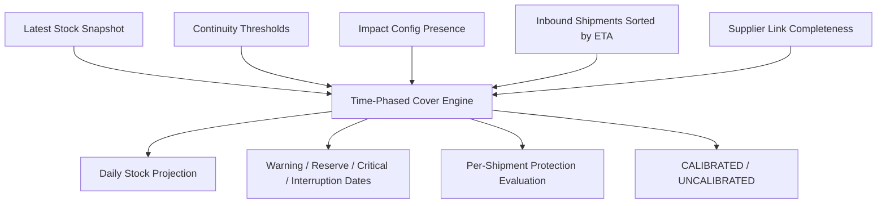

# OpsDeck Pilot Readiness Phase 1 Implementation

Date: 2026-06-04

Scope implemented:

1. Time-phased cover engine
2. Multi-shipment sequencing
3. Uncalibrated state
4. Supplier onboarding validation
5. Historical validation report V1

No dashboards, UI redesigns, or integrations were added.

## 1. Architecture Proposal

The implementation adds a backend reasoning layer under stock continuity:

- `apps/backend/app/modules/stock/time_phased_cover.py`

This module is intentionally independent of UI and API routing. It accepts explicit operational inputs and returns a structured reasoning object:

- projected stock by day
- warning date
- reserve breach date
- critical breach date
- interruption date
- shipment-by-shipment protection status
- first shipment that protects reserve breach
- first shipment that protects interruption
- calibration status and assumptions



The result is surfaced through:

- stock cover detail response
- direct stock time-phased API
- signal-engine inventory continuity response
- Past Incident Analysis report

## 2. Database Changes

No physical database migration was required for Phase 1.

Reason:

- Stock snapshots already exist in `stock_snapshots`.
- Shipments already exist in `shipments`.
- Thresholds already exist in `plant_material_thresholds`.
- Production impact config already exists in `production_interruption_impact_configs`.
- Supplier linkage already exists via `shipments.supplier_id`.
- Historical incidents already exist in `line_stop_incidents`.

Migration strategy:

- No schema migration is required for deployment.
- Existing tenants automatically receive time-phased reasoning when they have stock snapshots.
- Results are computed on read and are not persisted yet.
- If audit persistence is needed later, add a `historical_validation_runs` table in Phase 2.

## 3. API Changes

New/extended response fields:

- `StockCoverBreakdown.time_phased_cover`
- `StockCoverDetailResponse.time_phased_cover`
- `InventoryContinuityResult.time_phased_cover`
- `OperationalUnderstandingSummary.supplier_references_total`
- `OperationalUnderstandingSummary.supplier_references_linked`
- `OperationalUnderstandingSummary.supplier_references_unlinked`
- `OperationalUnderstandingSummary.onboarding_completeness_score`
- `OperationalUnderstandingSummary.supplier_reliability_impact`

New endpoint:

```http
GET /api/v1/stock/cover/{plant_id}/{material_id}/time-phased
```

Returns `TimePhasedCoverResult`.

New endpoint:

```http
GET /api/v1/line-stops/historical-validation?limit=25
```

Returns the internal `HistoricalValidationReport` response used by Past Incident Analysis.

## 4. Backend Implementation

### Time-Phased Cover

File:

- `apps/backend/app/modules/stock/time_phased_cover.py`

Main entrypoint:

- `evaluate_time_phased_cover`

Logic:

1. Start with latest usable stock.
2. Sort inbound shipments by ETA.
3. Consume stock chronologically.
4. Add inbound only when the shipment arrives.
5. Calculate breach dates from stock position:
   - warning
   - reserve
   - critical
   - interruption
6. Classify each shipment:
   - `PROTECTIVE`
   - `RESERVE_ON_ARRIVAL`
   - `CRITICAL_ON_ARRIVAL`
   - `LATE_AFTER_RESERVE`
   - `TOO_LATE`
7. Identify first shipment that extends reserve protection.
8. Identify first shipment that extends interruption protection.

### Multi-Shipment Sequencing

The engine no longer treats inbound only as an aggregate.

Each shipment is evaluated chronologically using:

- ETA
- raw quantity
- effective quantity
- supplier linkage
- stock before arrival
- stock after arrival

This answers:

- which shipment matters
- which shipment arrives too late
- which shipment actually protects continuity

### Uncalibrated State

The engine marks `calibration_status = "UNCALIBRATED"` when any required operating assumption is missing:

- warning threshold
- critical threshold
- reserve threshold
- production interruption impact configuration
- supplier master linkage

It also emits:

- `assumptions_used`
- reduced `confidence_score`

Defaults are still used only to make the projection computable, but they are exposed as assumptions rather than hidden.

### Supplier Onboarding Validation

File:

- `apps/backend/app/modules/ingestion/service.py`

Logic:

- Shipment upload supplier names are compared against active supplier master records.
- Upload response now reports linked/unlinked supplier references.
- The onboarding completeness score is reduced when suppliers are not linked.
- The warning explains that supplier reliability calculations are uncalibrated for those shipments.

### Past Incident Analysis Report V1

Files:

- `apps/backend/app/modules/line_stops/service.py`
- `apps/backend/app/modules/line_stops/router.py`
- `apps/backend/app/modules/line_stops/schemas.py`

Logic:

1. Load recorded line-stop incidents.
2. For each incident, find the latest stock snapshot before the incident.
3. Find thresholds for the plant/material.
4. Run time-phased cover from that historical snapshot.
5. Compare predicted warning date to incident date.
6. Report:
   - incident date
   - predicted warning date
   - lead time gained
   - missed signals
   - confidence level
   - calibration status

V1 limitation:

- It does not reconstruct historical shipment state unless shipment records existed with `latest_update_at <= incident_date`.
- It is a validation report, not a full replay engine.

## 5. Tests

Added:

- `apps/backend/tests/test_time_phased_cover.py`
- `apps/backend/tests/test_historical_validation_report.py`

Updated:

- `apps/backend/tests/test_ingestion_uploads.py`

Verified:

```bash
./.venv/bin/ruff check app/modules/stock/time_phased_cover.py app/modules/stock/service.py app/modules/stock/continuity.py app/modules/stock/router.py app/modules/ingestion/service.py app/modules/ingestion/schemas.py app/modules/line_stops/service.py app/modules/line_stops/router.py app/modules/line_stops/schemas.py tests/test_time_phased_cover.py tests/test_historical_validation_report.py tests/test_ingestion_uploads.py
```

Result:

- passed

```bash
./.venv/bin/python -m pytest tests/test_time_phased_cover.py tests/test_historical_validation_report.py tests/test_inventory_continuity.py tests/test_stock_cover.py tests/test_ingestion_uploads.py
```

Result:

- 58 passed
- 5 warnings

## 6. Calibration Considerations

This is Phase 1 reasoning, not final plant-grade calibration.

Important calibration decisions still required:

1. Reserve threshold should be agreed per plant/material.
2. Warning and critical days should not be global defaults in pilots.
3. Effective shipment quantity should eventually use route/mode/source reliability, not only current confidence.
4. Production interruption should move from point estimate to range.
5. Historical validation should be run against real prior incidents before pilot acceptance.
6. Supplier completeness score should be part of onboarding acceptance criteria.
7. Inbound ETA should later account for port, rail, and road lifecycle state.

## 7. Migration Strategy

Deployment:

1. Deploy backend code.
2. No Alembic migration required.
3. Existing stock, shipment, threshold, supplier, and incident records remain valid.
4. Existing frontend can ignore new response fields.
5. API consumers can start reading `time_phased_cover` immediately.

Pilot data readiness:

1. Load stock snapshots.
2. Load thresholds including reserve fields.
3. Load shipment rows with supplier names.
4. Create supplier master records before pilot scoring.
5. Record/import historical incidents for validation.
6. Call Past Incident Analysis report and review missed signals.

Rollback:

- Code rollback is sufficient.
- No database rollback is required because no schema changes were introduced.
